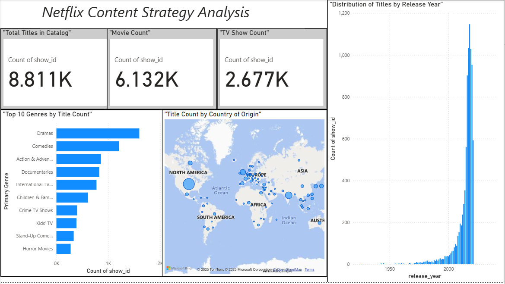

# Netflix Content Strategy Analysis using Power BI

## Executive Summary
This project involves the analysis of the Netflix content library to identify strategic insights for content acquisition. By visualizing the distribution of TV shows and movies by genre, country of origin, and release year, this dashboard provides actionable recommendations for diversifying the platform's catalog to appeal to a broader international audience.

## Dashboard Preview

---

### Key Questions Addressed
- What is the overall composition of the Netflix catalog (Movies vs. TV Shows)?
- Which genres are most prevalent on the platform?
- What is the geographic distribution of content production?
- How has the volume of content added to the platform changed over time?

---

### Tools Used
- **Power BI:** For data modeling, analysis, and interactive dashboard creation.
- **Power Query:** For data cleaning, transformation, and preparation (handling nulls, splitting columns).
- **DAX (Data Analysis Expressions):** Used for creating calculated columns (`Primary Genre`, `Primary Country`).

---

### Analysis & Key Insights
- **US-Centric Catalog:** The analysis revealed that the content library is heavily dominated by titles produced in the United States, indicating a potential saturation in the domestic market.
- **Genre Concentration:** Dramas and Comedies are the most common genres. While popular, this points to an opportunity to invest in under-represented genres to attract niche audiences.
- **Recommendation:** The primary recommendation is for the content acquisition team to strategically invest in international comedies and dramas. This would diversify the catalog, reduce reliance on the US market, and cater to a growing global subscriber base.

---

### Data Source
- **Dataset:** [Netflix Movies and TV Shows on Kaggle](https://www.kaggle.com/datasets/rahulvyasm/netflix-movies-and-tv-shows)

---

### How to View the Project
1. **Download the Power BI File:** You can download the `.pbix` file from this repository to view the full interactive dashboard in Power BI Desktop.
